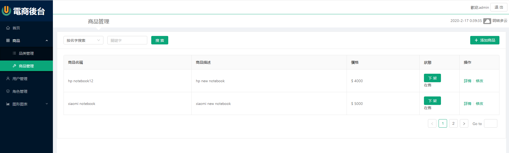

A backend admin system for shop using `react` + `react router` + `axios` + `antd` + `echart` to build up, backend use `express` + `mongodb`  

### `npm start`

Runs the app in the development mode. 
Open [http://localhost:3000](http://localhost:3000) to view it in the browser.

screen shot:

### backend
[https://github.com/wong2444/react_admin_client_backend](https://github.com/wong2444/react_admin_client_backend)
